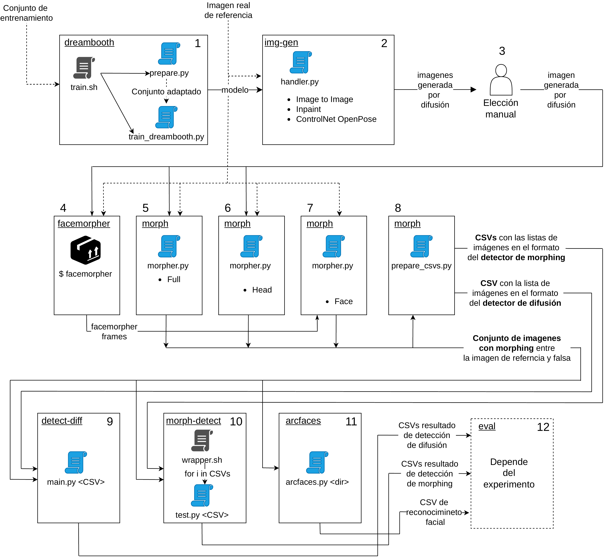
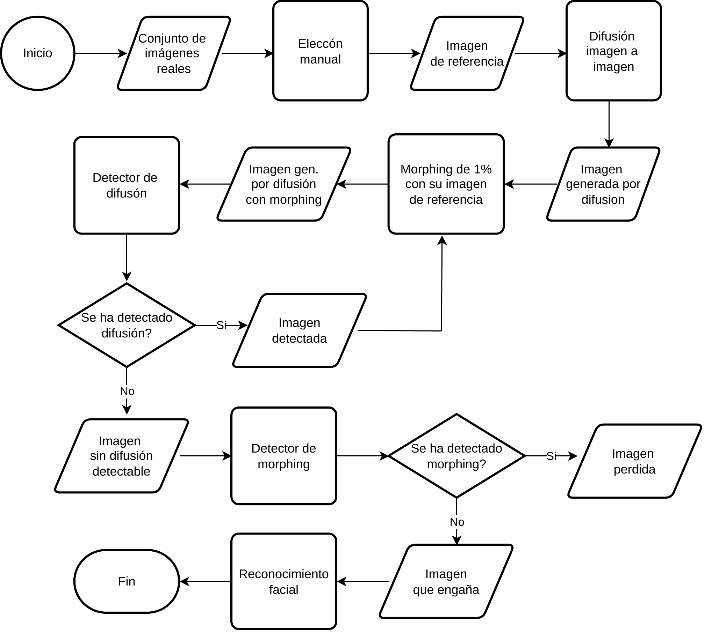

# Study of morphing techniques to hide stable diffusion generated faces
This is the final project for my Computer Engineering degree, in which I tested Stegano-Morphing on images generated by Stable Diffusion. Stegano-Morphing is a technique in image processing by which two different images or frames are merged into a single one. It has been used to effectively hide images generated by GANs. Stable Diffusion is based on a reverse diffusion process, instead of adversarial networks. There has been an effort to develop new detection techniques for these new generated images. In this project, inspired by "Stegano-Morphing: Concealing Attacks on Face Identification Algorithms" (10.1109/ACCESS.2021.3088786), I checked the viability of morphing images generated by Stable Diffusion to hide them from a diffusion image detector "On the detection of synthetic images generated by diffusion models" (https://github.com/grip-unina/dmimagedetection) while keeping the morphing low enough to not be detected by a Morphing Attack Detector "SPL-MAD" (https://github.com/meilfang/SPL-MAD).

The system is divided into twelve parts, with each running in it's own docker container. I use nvidia-container-runtime to use GPU acceleration for the workloads, while keeping the python dependencies separate and isolated. The parts are mostly python scripts in which I make heavy use of AI libraries. These are then run in the correct order by bash scripts. The main technologies I used are:
- Dreambooth: to train a custom Stable Diffusion 1.5 model with images of people outside of it's training set
- Image generation with Stable Diffusion through the Diffusers library. I have implemented the pipelines for:
  - Text to image: where an image is generated just from a text prompt
  - Image to image: where a reference image is used alongside the text prompt
  - ControlNet: where specific contents of the reference image are converted into latent space before being fed into the generation. In particular, OpenPose, to get the precise position of people in the reference image
  - Inpainting: where the reference image is accompanied with a mask that indicates what part of the reference image is to be filled with generated content
- Morphing
  - Traditional morphing: super-imposition of partially transparent frames to merge them together
  - Partial traditional morphing: merging just the part of the reference image that has a face with the generated image, to reduce the detectability
  - Triangle mesh morphing using Facemorpher (https://pypi.org/project/facemorpher/): where new faces are generated by finding the key points of the reference faces, and then manipulating the faces to slowly transform from one into the other
- Diffusion generated image detection
- Morphing Attack Detection
- Face recognition using the Deepface implementation of ArcFace (https://github.com/serengil/deepface): to check that morphed images have the face of the target

The system can be run in order using `compose-services.sh`, which launches the docker-compose services for each part. There are also several `experiment-N.sh` scripts for specific parts. The most interesting of these is `experiment-5.sh`, in which I used the elements of the system to replicate the algorithm described in "Stegano-Morphing: Concealing Attacks on Face Identification Algorithms"

